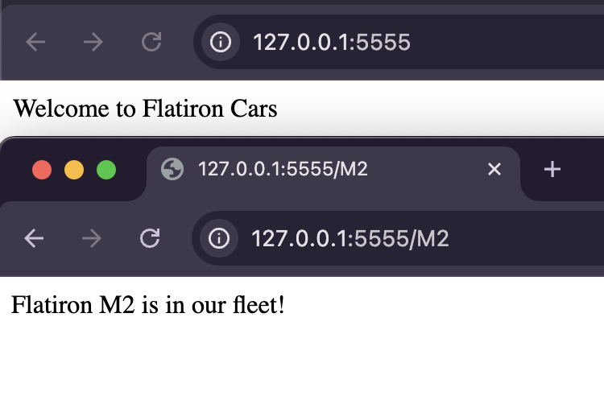

# Car Routes Lab
 
 A simple Flask application for Flatiron Cars. The app has two routes: a root route that welcomes you to Flatiron Cars, and a dynamic route that checks if a specific car model exists in our fleet.

---
## Table of Contents

- [Demo](#demo)  
- [Setup](#setup)  
- [Features](#features)
- [Usage](#usage)
- [Testing](#testing) 

---

## Demo

---

## Setup
1. Fork & Clone the repo.

2. Navigate into the "server" folder where the Flask app is found:
  `cd server`

3. Install dependencies and activate the virtual environment: 
  `pipenv install`
  `pipenv shell`

4. Set environment variables and run server:
  `export FLASK_APP=app.py`
  `export FLASK_RUN_PORT=5555`
  `flask run`
  

---

## Features

- Root route (/): 
  Displays a welcome message.

- Model route (/<model>): 
  Looks up existing_models and returns:
    • "Flatiron {model} is in our fleet!" if found.
    • "No models called {model} exists in our catalog" if not found.

---

## Usage

- Navigate to http://127.0.0.1:5555/ on browser to see the welcome message.

- To check a specific model, append the model name to the URL. For example: http://127.0.0.1:5555/M2 (or any other model in "existing_models")

---

## Routes

1. Method: GET  | Endpoint: ` / ` |Response: `Welcome to Flatiron Cars`

2. Method: GET  | Endpoint: ` /<model> `  | Response: `Flatiron {model} is in our fleet!` or `No models called {model} exists in our catalog`

---

## Testing

- To test the existing test suite run: `pytest`
